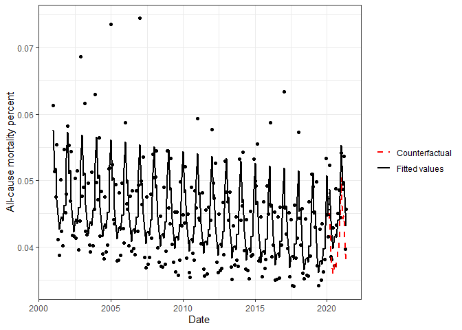

README
================

# its2es

This package implements interrupted time series analysis for both
continuous and count outcomes, and quantifies the associated effect
size, as described in Effect Size Quantification for Interrupted Time
Series Analysis: Implementation in R for Covid-19 Research. The main
functions fit an ITS regression model, and then use the fitted values
and the model-based counterfactual values to quantify the effect size
(Cohen’s d for continuous outcomes and relative risk for count
outcomes). An example describing how to install and use this package is
described below. A more detailed tutorial, including the entire data
analysis described in the paper, is also available with this package
(Rmd + PDF file).

## Installation

You can install the package from its [GitHub
repository](https://github.com/Yael-Travis-Lumer/its2es/). You first
need to install the [devtools](https://github.com/r-lib/devtools)
package.

``` r
install.packages("devtools",repos = "http://cran.us.r-project.org")
```

Then install its2es using the `install_github` function in the
[devtools](https://github.com/r-lib/devtools) package.

``` r
library(devtools)
install_github("Yael-Travis-Lumer/its2es")
```

## Example

1.  Load library and unemployment data (discussed in paper)

``` r
library(its2es)
data <- unemployed
```

2.  Define formula and intervention start index for the Covid-19 period

``` r
form <- as.formula("percent ~ time")
intervention_start_ind <- which(data$year==2020 & data$month>2| data$year==2021)[1]
```

3.  Fit a linear regression ITS model

``` r
fit <- its_lm(data=data,form=form,time_name = "time",intervention_start_ind=intervention_start_ind, freq=12,seasonality= "none", impact_model = "full",counterfactual = TRUE)
```

    ## 
    ## Call:
    ## lm(formula = form_update, data = data)
    ## 
    ## Residuals:
    ##      Min       1Q   Median       3Q      Max 
    ## -0.90067 -0.28348  0.00614  0.28684  0.99957 
    ## 
    ## Coefficients:
    ##                         Estimate Std. Error t value Pr(>|t|)    
    ## (Intercept)             6.365092   0.084581  75.254  < 2e-16 ***
    ## time                   -0.034883   0.001689 -20.656  < 2e-16 ***
    ## indicator               0.606417   0.208999   2.902   0.0046 ** 
    ## indicator:shifted_time  0.130377   0.023295   5.597 2.03e-07 ***
    ## ---
    ## Signif. codes:  0 '***' 0.001 '**' 0.01 '*' 0.05 '.' 0.1 ' ' 1
    ## 
    ## Residual standard error: 0.3888 on 97 degrees of freedom
    ## Multiple R-squared:  0.8222, Adjusted R-squared:  0.8167 
    ## F-statistic: 149.5 on 3 and 97 DF,  p-value: < 2.2e-16
    ## 
    ## Mean difference         2.5% CI        97.5% CI         P-value 
    ##        1.519055        1.248129        1.789981        0.000000 
    ## Cohen's d   2.5% CI  97.5% CI   P-value 
    ##  4.724988  3.130926  7.809674  0.000000

4.  Plot predicted values and counterfactual values

``` r
p <- plot_its_lm(data=fit$data,intervention_start_ind,y_lab="Unemployment percent",response="percent", date_name= "dt")
p
```

<!-- -->
